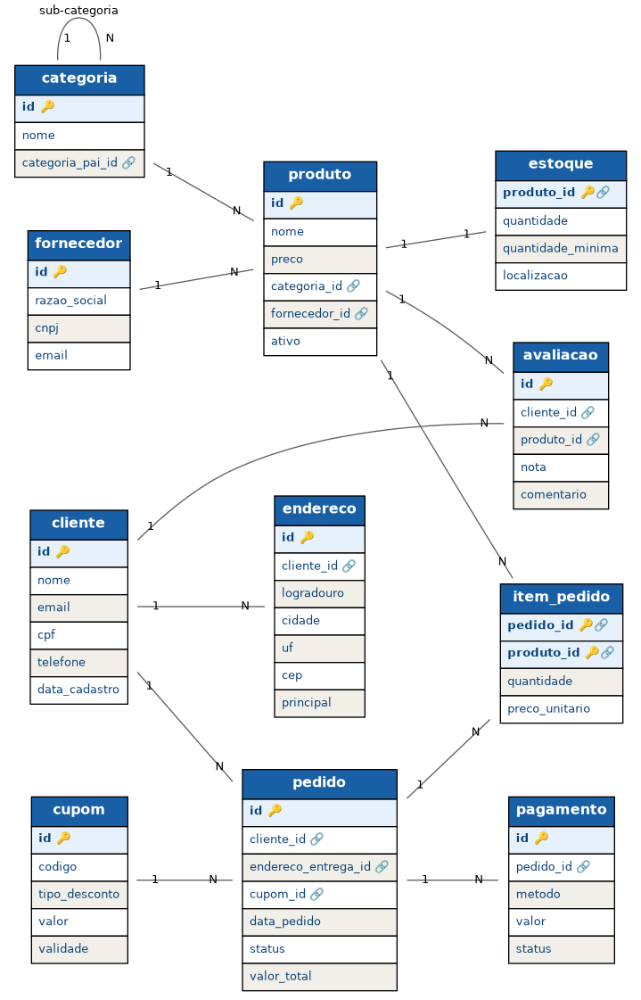

# 🗄️ Banco de Dados Relacional com PostgreSQL

Apostila didática construída para ensinar banco de dados relacional **lado a lado com a prática** — cada conceito teórico vira imediatamente código SQL executável. O estudo de caso é um **sistema de e-commerce** completo, escolhido por cobrir naturalmente todos os tipos de relacionamento (1:1, 1:N, N:M e auto-relacionamento) e situações reais do dia a dia.

> **Prof. Dr. Anuar José Mincache** · Universidade Estadual de Maringá (UEM)  
> 🔬 [Lattes](http://lattes.cnpq.br/9526608938362113) · 💼 [LinkedIn](https://www.linkedin.com/in/anuar-mincache/) · 💻 [GitHub](https://github.com/220719) · 🆔 [ORCID 0000-0001-8528-8020](https://orcid.org/0000-0001-8528-8020)

---

## 📚 Partes da apostila

| Parte | Conteúdo | Status |
|-------|----------|--------|
| **Parte 1** | Fundamentos, Modelagem (MER), Normalização 1FN→3FN, DDL completo | ✅ Disponível |
| Parte 2 | DML — INSERT, UPDATE, DELETE, transações ACID, UPSERT | 🔜 Em breve |
| Parte 3 | DQL — SELECT, WHERE, ORDER BY, JOINs, agregações, CTEs | 🔜 Em breve |
| Parte 4 | Window Functions, Functions, Triggers, JSON | 🔜 Em breve |
| Parte 5 | Performance, índices avançados, boas práticas, documentação | 🔜 Em breve |

---

## 📖 O que tem na Parte 1 (20 páginas)

### Capítulos
| # | Título | Destaques |
|---|--------|-----------|
| 1 | Fundamentos de Banco de Dados | SGBD, modelo relacional, por que PostgreSQL, propriedades ACID |
| 2 | O Projeto: sistema de e-commerce | Levantamento de requisitos, 7 regras de negócio documentadas |
| 3 | Modelagem Conceitual (MER) | Entidades, atributos, cardinalidade, diagrama ER completo |
| 4 | Modelagem Lógica | Mapeamento MER→tabelas, tabela associativa N:M |
| 5 | Normalização aplicada | Anomalias, 1FN, 2FN e 3FN passo a passo com exemplos reais |
| 6 | Criação do banco (DDL) | CREATE DATABASE, tipos de dados, constraints, FKs, índices |
| — | Dicionário de dados | Todas as 12 tabelas documentadas com PK, FKs e papel |
| — | 5 questões de múltipla escolha | Com gabarito comentado |

### Caixas didáticas ao longo do texto

| Ícone | Tipo | O que traz |
|-------|------|------------|
| ◆ | **No mundo real** | Como sistemas reais lidam com o problema — decisões e armadilhas |
| ★ | **Dica** | Boas práticas e atalhos para um trabalho mais limpo |
| ▲ | **Atenção** | Pontos onde é fácil errar |
| ✕ | **Erro comum** | Erros clássicos de quem está começando — para você não cometê-los |
| ◉ | **Sacada** | O insight que amarra o conceito |

---

## 🗂️ Estrutura do repositório

---

## ⚡ Início rápido

### Pré-requisitos
- [PostgreSQL 16+](https://www.postgresql.org/download/)
- [pgAdmin 4](https://www.pgadmin.org/) ou `psql`

### Executar os scripts em ordem
```bash
psql -U postgres -f sql/01-create-database.sql
psql -U postgres -d ecommerce -f sql/02-create-tables.sql
psql -U postgres -d ecommerce -f sql/03-constraints-indexes.sql
psql -U postgres -d ecommerce -f sql/04-seed-data.sql
```

Ou abra cada `.sql` no **Query Tool do pgAdmin** e pressione **F5**.

---

## 🏗️ O banco: sistema de e-commerce

12 tabelas cobrindo **todos os tipos de relacionamento**:

| Tabela | Papel | Tipo de relacionamento |
|--------|-------|----------------------|
| `cliente` | Quem compra | — |
| `endereco` | Endereços de entrega | **1:N** com cliente |
| `categoria` | Hierarquia de produtos | **Auto-relacionamento** |
| `fornecedor` | Quem fornece | — |
| `produto` | Itens à venda | **1:N** com categoria e fornecedor |
| `estoque` | Quantidade em estoque | **1:1** com produto |
| `cupom` | Descontos aplicáveis | — |
| `pedido` | Compras realizadas | **1:N** com cliente |
| `item_pedido` | Itens de cada pedido | **N:M** pedido × produto (com atributos) |
| `pagamento` | Pagamentos | **1:N** com pedido |
| `avaliacao` | Notas e comentários | **N:M** com atributos |

### Diagrama ER



---

## 📋 Regras de negócio implementadas em SQL

| RN | Constraint usada | Descrição |
|----|-----------------|-----------|
| RN1 | `UNIQUE` | E-mail de cliente é único no sistema |
| RN2 | `NOT NULL` + FK | Produto tem exatamente uma categoria e um fornecedor |
| RN3 | `CHECK (preco >= 0)` | Preço e estoque nunca negativos |
| RN4 | `CHECK (nota BETWEEN 1 AND 5)` | Avaliação só aceita notas de 1 a 5 |
| RN5 | coluna `preco_unitario` em `item_pedido` | Preço congelado no momento da compra |
| RN6 | `CHECK (status IN (...))` | Status do pedido só aceita valores válidos |
| RN7 | `ON DELETE CASCADE` | Itens são apagados automaticamente com o pedido |

---

## 📄 Licença

Material didático de uso livre para fins educacionais.  
Cite como: *Mincache, A. J. (2025). Banco de Dados Relacional com PostgreSQL. UEM.*
